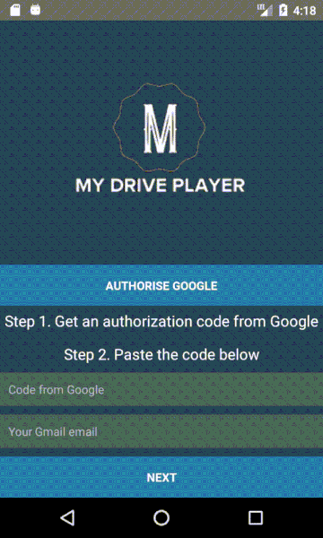

# My Drive music player #

This is a mini project I have done in Nov 2018 in about a week. It's a React Native MP3 player streaming from my Google Drive via Open ID authentication.

There was also a Spring Boot backend acting in the middle to serve the mp3s, which had gone lost. I hope I will be able to rewrite it soon.

# How it works

The app initially requests an authorisation code to connect to the google's own drive. 
After the authorisation all mp3 files in a specific Drive's path are scanned and streamed immediately. 
The music player allows to: pause, resume, skip, fast forward etc.

# Demo

# Run
`$ react-native run-android`

# Code
Start snooping around from App.js. 

# Disclamer
This App is not intended for commercial usage, but for own personal learning experience.
